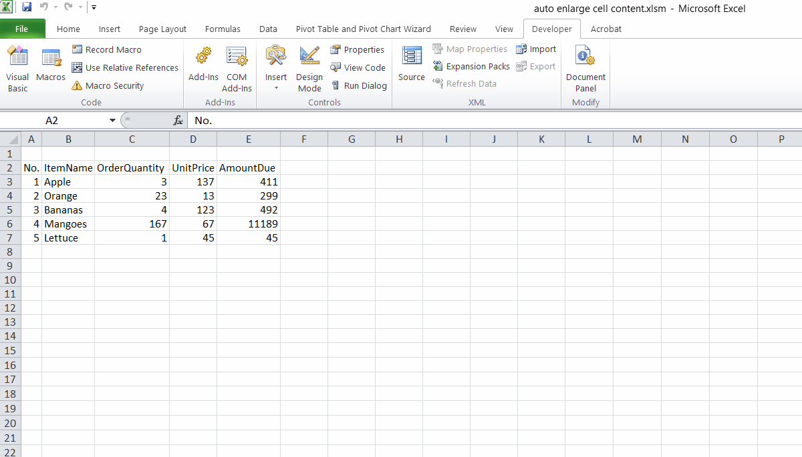

# Dynamically Enlarging an Excel Worksheet's ActiveCell

A few days ago, I came across a question in a facebook group where Myanmar people share, learn and discuss MS Excel related information.\
The question is about making the ActiveCell in the worksheet bigger/larger/zoomed-in.\
The OP didn't mention why he needed that feature.

Normally, I don't like to mess up the Excel UI for the user.\
And I warned the OP that changing the cell size like that would be dizzying and made sure that he wanted this knowing possible side effects.

The following .gif is provided just to clarify the OP's requirements and the answer I created.

Also available on [StackOverflow as a self-answered Q&A post](https://stackoverflow.com/questions/69795647/excel-vba-how-to-dynamically-enlarge-expand-activecell/69795648#69795648).

## Possible solutions
I could immediately think of 4 methods that I may be able to use to achieve that goal.

1. Manipulate the ActiveCell's rowHeight and columnWidth properties. (most likely)
2. Play with ActiveCell's column's Autofit. (I don't think it'd give the desired effect)
3. Play with the Worksheet's Zoom %. (not really)
4. Place a textbox on a modeless userform and put the activecell's contents into it. (I love it)

Among those 4, method1 is most likely what the OP wanted. But I believe that it would be quite disturbing to the user's eyes.
And the only other worthy contender, IMHO, is the method4 as it seems more elegant and less distracting to the user.
The remaining 2, I don't even bother to try.
